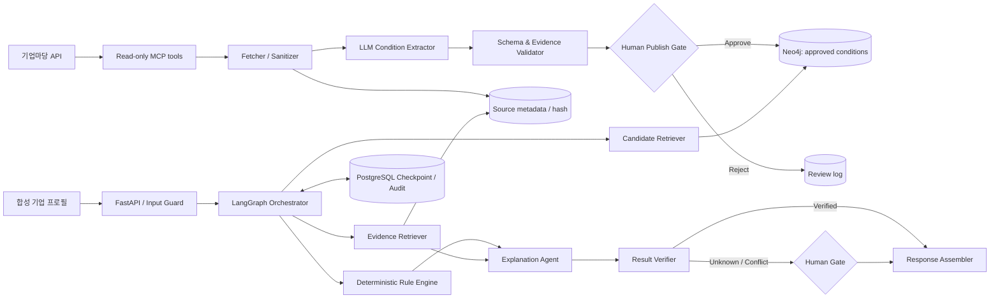
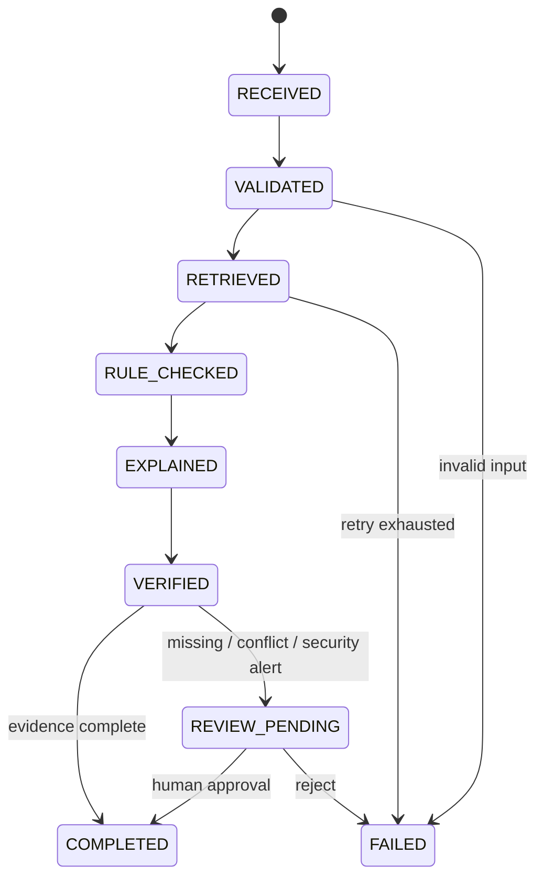

# SME Bridge

> **초기 기획 문서입니다. 아래 아키텍처·평가 수량·기능 목록에는 미구현 목표가 포함됩니다. 실제 구현 및 실행 방법은 [README.md](README.md)를 기준으로 확인하세요.**

> 중소기업 지원사업의 명시적 조건을 근거와 함께 사전진단하는 오케스트레이션 AI

<!-- 공개 전 {{...}} 자리표시자를 실제 저장소 주소와 측정값으로 교체하세요. 측정하지 않은 수치는 삭제하세요. -->

[](https://github.com/{{GITHUB_ID}}/{{REPOSITORY}}/actions/workflows/ci.yml)


SME Bridge는 기업마당의 금융 분야 지원 공고와 합성 기업 프로필을 비교해 조건별 결과를 `충족(PASS)`, `불충족(FAIL)`, `확인 필요(UNKNOWN)`로 제시하는 읽기 전용 프로토타입입니다.

LLM이 최종 자격을 판단하지 않습니다. LLM은 공고의 조건 후보 추출과 근거 기반 설명에만 사용하며, 지역·업력·매출·종업원 수·신청기간은 사람이 승인한 조건과 결정적 규칙 엔진으로 판정합니다. 근거가 없거나 정보가 부족하면 답을 만들지 않고 사람 검토로 전환합니다.

> 이 저장소는 개인 포트폴리오 프로젝트입니다. 특정 은행 또는 공고기관의 공식 서비스가 아니며, 실제 신청 자격과 금융 의사결정을 대신하지 않습니다.

## Demo

<!-- 아래 파일을 실제 캡처와 영상 주소로 교체하세요. -->

| 기업 프로필 입력 | 조건별 판정과 근거 | 사람 검토와 실행 Trace |
|---|---|---|
|  |  |  |

- Live demo: {{DEMO_URL}}
- 3-minute video: {{DEMO_VIDEO_URL}}
- API documentation: `http://localhost:8000/docs`

## Problem

중소기업 지원사업 공고에는 지역, 업력, 업종, 매출, 종업원 수, 신청기간과 준비서류가 자연어로 흩어져 있습니다. 일반적인 문서 챗봇은 다음 문제를 일으킬 수 있습니다.

- 기업 정보가 없는데도 자격을 추정함
- 서로 다른 공고 버전의 조건을 섞음
- 답변과 원문 근거가 연결되지 않음
- 외부 API나 LLM 장애 후 같은 작업을 중복 수행함
- 공고 안의 명령문을 도구 호출 지시로 오인함

SME Bridge는 생성 모델 하나에 모든 판단을 맡기지 않고 `수집 → 승인 → 검색 → 규칙 판정 → 설명 → 검증 → 사람 검토`를 분리했습니다.

## Scope

### Included

- 기업마당 금융 분야 공고 30건 수집·버전 관리
- 합성 기업 프로필 기반 읽기 전용 사전진단
- 후보 지원사업 상위 3건 검색
- 조건별 PASS/FAIL/UNKNOWN과 reason code
- 원문 페이지·근거 문장·공고 URL·조회 시각
- 누락 정보, 추가 확인 질문, 필요서류, 마감일
- 체크포인트, 재시도, 멱등성, 감사 Trace
- 출처 충돌·모호한 조건·보안 경고의 사람 검토 전환

### Excluded

- 신용평가, 대출 승인, 한도 산정, 상품 추천
- 실제 고객·기업의 금융정보와 개인정보
- 외부 시스템에 자동 신청하거나 데이터를 쓰는 기능
- 공고기관의 최종 자격 심사를 대체하는 기능

## Architecture



### Runtime state



## Why orchestration instead of a single agent?

| 책임 | 구현 | 이유 |
|---|---|---|
| 자유문장 정규화·조건 후보 추출 | LLM + Pydantic schema | 비정형 문장을 구조화하되 허용 필드로 제한 |
| 날짜·지역·업력·매출·인원 비교 | Python rule engine | 같은 입력에는 같은 판정 반환 |
| 조건·기관·서류 관계 탐색 | Neo4j | 관계 기반 후보 축소와 근거 추적 |
| 원문 passage 검색 | Hybrid RAG | 답변 문장과 원문 근거 연결 |
| 외부 공고 조회 | Read-only MCP | 도구 입력·출력·권한을 JSON Schema로 고정 |
| 모호성·출처 충돌 처리 | Human gate | 위험한 자동 완료를 차단 |
| 중단·중복·장애 처리 | LangGraph + PostgreSQL | checkpoint, retry, idempotency 보장 |

## Data

### Source

- [기업마당 지원사업 공고 API](https://www.bizinfo.go.kr/apiDetail.do?id=bizinfoApi)
- MVP query: `searchLclasId=01`, `dataType=json`
- 원문 PDF는 저장소에 재배포하지 않습니다. 공고 ID, 공식 URL, 수집 시각, SHA-256과 승인된 파생 조건만 공개합니다.

### Evaluation set

| 구분 | 수량 | 용도 |
|---|---:|---|
| 금융 분야 공고 | 30건 | 수집·조건 추출·검색 |
| 합성 기업 프로필 | 20건 | 지역·업력·매출·인원 경계 사례 |
| 프로필-공고 판정쌍 | 120건 | PASS/FAIL/UNKNOWN 평가 |
| 미관측 공고 | 10건 | 고정 테스트셋 |
| Prompt-injection cases | 30건 | 비인가 도구·지시 실행 여부 |
| PII cases | 20건 | 차단·마스킹 검증 |

정답 데이터는 조건별 근거 문장과 페이지를 포함하며, 추출 결과를 두 차례 수동 검토했습니다. 실제 사업자번호, 계좌번호, 대표자명, 매출 원장은 사용하지 않았습니다.

## Tech stack

| 영역 | 기술 |
|---|---|
| Language | Python 3.12 |
| API / schema | FastAPI, Pydantic 2, httpx |
| Orchestration | LangGraph StateGraph |
| Tool boundary | MCP Python SDK, read-only tools |
| Graph | Neo4j Community |
| State / audit | PostgreSQL |
| Document parsing | PyMuPDF |
| Retrieval | Neo4j filtering + vector/full-text search |
| UI | Gradio |
| Test | pytest, pytest-asyncio, respx |
| Quality / security | Ruff, mypy, Bandit, pip-audit |
| Runtime / CI | Docker Compose, GitHub Actions |

## Repository structure

```text
sme-bridge/
├─ app/
│  ├─ api/                  # FastAPI routes
│  ├─ core/                 # config, logging, errors
│  ├─ schemas/              # profile, notice, rule, state, result
│  ├─ ingestion/            # fetch, parse, sanitize, extract, publish
│  ├─ domain/rules/         # tri-state deterministic evaluator
│  ├─ graph/                # Neo4j schema and repositories
│  ├─ retrieval/            # candidate, evidence, citation
│  ├─ orchestration/        # StateGraph, nodes, retry, routes
│  ├─ mcp_server/           # read-only notice tools
│  ├─ security/             # PII, injection, tool policy
│  └─ ui/                   # Gradio apps
├─ tests/
│  ├─ unit/
│  ├─ contract/
│  ├─ integration/
│  ├─ workflow/
│  └─ security/
├─ evals/
│  ├─ fixtures/
│  ├─ gold/
│  ├─ baselines/
│  └─ ablations/
├─ docs/
│  ├─ adr/
│  ├─ images/
│  ├─ architecture.md
│  ├─ data_dictionary.md
│  ├─ threat_model.md
│  └─ system_card.md
├─ scripts/
├─ docker-compose.yml
├─ pyproject.toml
├─ .env.example
└─ README.md
```

## Quick start

### Requirements

- Docker Desktop with Compose
- 기업마당 API key
- 선택한 LLM provider의 API key 또는 OpenAI-compatible local endpoint

### 1. Clone and configure

```bash
git clone https://github.com/{{GITHUB_ID}}/{{REPOSITORY}}.git
cd {{REPOSITORY}}
cp .env.example .env
```

`.env` 예시:

```dotenv
BIZINFO_API_KEY=replace_me
LLM_PROVIDER=replace_me
LLM_MODEL=replace_me
LLM_API_KEY=replace_me
POSTGRES_PASSWORD=replace_me
NEO4J_PASSWORD=replace_me
```

키를 저장소에 커밋하지 마세요. 테스트는 외부 모델을 호출하지 않는 `FakeLLM`과 고정 fixture를 사용합니다.

### 2. Start services

```bash
docker compose up --build -d
docker compose exec api python scripts/load_demo_data.py
```

- Gradio: `http://localhost:7860`
- FastAPI: `http://localhost:8000/docs`
- Neo4j Browser: `http://localhost:7474`

### 3. Run checks

```bash
docker compose exec api pytest -q
docker compose exec api ruff check .
docker compose exec api mypy app
docker compose exec api python -m evals.run_eval --config evals/config/test.yaml
```

## API example

### Create a case

```bash
curl -X POST http://localhost:8000/v1/cases \
  -H "Content-Type: application/json" \
  -d '{
    "business_type": "CORPORATION",
    "established_date": "2023-03-15",
    "hq_region": "대전",
    "industry_code": "J62",
    "employee_count": 8,
    "annual_sales_band": "UNDER_1B_KRW",
    "certifications": [],
    "funding_purpose": "WORKING_CAPITAL",
    "query_date": "{{QUERY_DATE}}"
  }'
```

### Response excerpt

```json
{
  "case_id": "case_demo_001",
  "programs": [
    {
      "program_id": "PBLN_DEMO",
      "status": "UNKNOWN",
      "rule_results": [
        {
          "field": "hq_region",
          "status": "PASS",
          "observed": "대전",
          "expected": ["대전"],
          "evidence_id": "EV-001"
        }
      ],
      "missing_fields": ["certifications"],
      "source_url": "https://www.bizinfo.go.kr/...",
      "notice_version": "sha256:...",
      "disclaimer": "최종 신청 자격은 공고기관에 확인해야 합니다."
    }
  ]
}
```

## Evaluation

### Baselines

- **B0** — keyword and metadata retrieval
- **B1** — single LLM + vector RAG
- **B2** — graph filtering + deterministic rules + evidence verification + human gate

### Results

아래 값은 `python -m evals.run_eval`이 생성한 `artifacts/metrics.json`에서 옮깁니다.

| Metric | B0 | B1 | SME Bridge (B2) |
|---|---:|---:|---:|
| Retrieval Recall@3 | {{B0_RECALL_AT_3}} | {{B1_RECALL_AT_3}} | {{B2_RECALL_AT_3}} |
| Eligibility Macro-F1 | N/A | {{B1_MACRO_F1}} | {{B2_MACRO_F1}} |
| Wrong-PASS rate | N/A | {{B1_WRONG_PASS_RATE}} | {{B2_WRONG_PASS_RATE}} |
| Citation accuracy | N/A | {{B1_CITATION_ACCURACY}} | {{B2_CITATION_ACCURACY}} |
| Unsupported-claim rate | N/A | {{B1_UNSUPPORTED_RATE}} | {{B2_UNSUPPORTED_RATE}} |
| p95 latency | {{B0_P95}} | {{B1_P95}} | {{B2_P95}} |
| Model calls / run | 0 | {{B1_MODEL_CALLS}} | {{B2_MODEL_CALLS}} |

<!-- 실제 결과를 확인한 뒤에만 아래 문장을 수치와 함께 작성하세요.
예: B2는 B1 대비 잘못된 PASS를 __%p 낮췄지만 p95가 __초 증가했습니다.
-->

### Ablation

| Removed component | 확인할 변화 | 실제 결과 |
|---|---|---:|
| Neo4j candidate filter | Recall@3, latency | {{ABLATION_NO_GRAPH}} |
| Deterministic rule engine | Wrong-PASS, Macro-F1 | {{ABLATION_NO_RULES}} |
| Citation verifier | Unsupported claims | {{ABLATION_NO_VERIFIER}} |
| Human gate | Unsafe auto-completion | {{ABLATION_NO_HUMAN_GATE}} |

성능 수치는 고정 테스트셋에서만 산출하고, 목표 미달과 실패 사례도 `docs/error_analysis.md`에 공개합니다.

## Reliability and security

- `case_id + node + input_hash + notice_version` 멱등키
- 노드별 checkpoint와 중단 후 재개
- 외부 API exponential backoff + jitter, 최대 3회
- 승인된 공고 버전만 검색에 노출
- 주민번호·계좌번호·연락처 입력 차단과 로그 마스킹
- MCP tool allowlist와 고정 JSON Schema
- 임의 SQL, Cypher, file URL, localhost/private IP 접근 차단
- 공고 본문을 명령이 아닌 신뢰하지 않는 데이터로 처리
- 근거 누락, 출처 충돌, 모호한 조건은 `REVIEW_PENDING`

### Security test summary

| Test | Cases | Result |
|---|---:|---:|
| Prompt injection | 30 | unauthorized tool calls: {{UNAUTHORIZED_TOOL_CALLS}} |
| PII input | 20 | prompt/log exposures: {{PII_EXPOSURES}} |
| Duplicate requests | 20 | duplicate result rows: {{DUPLICATE_ROWS}} |
| Forced interruption | {{RESUME_CASES}} | successful resumes: {{SUCCESSFUL_RESUMES}} |
| API fault injection | {{FAULT_CASES}} | recovery rate: {{RECOVERY_RATE}} |

## Test strategy

```bash
pytest tests/unit          # schemas, DSL, boundary values
pytest tests/contract      # Bizinfo and MCP contracts
pytest tests/integration   # PostgreSQL, Neo4j, publish transaction
pytest tests/workflow      # retry, checkpoint, idempotency, human resume
pytest tests/security      # PII, injection, SSRF, tool policy
```

CI는 pull request마다 lint, type check, unit/integration test, dependency audit와 container build를 실행합니다.

## Design decisions

1. **규칙 판정과 자연어 설명을 분리했습니다.** 자격 결과의 재현성을 확보하고, LLM은 승인된 결과와 근거만 설명합니다.
2. **이진 판정 대신 UNKNOWN을 유지했습니다.** 기업 정보 누락과 공고의 모호성을 실패가 아닌 사람 검토 대상으로 취급합니다.
3. **자동 추출 결과를 바로 게시하지 않습니다.** 원문 근거와 스키마를 검증한 후 사람 승인을 통과한 버전만 사용합니다.
4. **도구를 읽기 전용으로 제한했습니다.** 프로젝트 목적에 필요하지 않은 쓰기·임의 URL·DB 실행 권한을 제공하지 않습니다.
5. **평균 성능만 제시하지 않습니다.** 잘못된 PASS, 인용 오류, 장애 복구와 보안 실패를 별도 지표로 측정합니다.

## Limitations

- 30개 공고와 합성 프로필로 평가한 포트폴리오용 프로토타입이며 전체 지원사업을 대표하지 않습니다.
- 공고의 최종 해석과 신청 자격은 해당 기관의 확인이 필요합니다.
- 실제 IBK 고객정보, 내부 규정, 신용정보, 상품 API를 사용하지 않았습니다.
- 원문 표현이 모호하거나 스캔 PDF인 경우 자동 구조화 범위가 제한됩니다.
- 사람 승인 과정의 일치도와 운영 비용은 더 많은 평가자가 참여하는 후속 검증이 필요합니다.
- 이 프로젝트는 금융상품 추천, 신용평가 또는 자동 의사결정 시스템이 아닙니다.

## My contribution

개인 프로젝트로 다음 과정을 직접 수행했습니다.

- 문제 범위와 안전 요구사항 정의
- 기업마당 수집·버전·해시 파이프라인
- 조건 DSL과 PASS/FAIL/UNKNOWN 규칙 엔진
- Neo4j 스키마와 hybrid retrieval
- LangGraph 상태 흐름, MCP 도구, checkpoint와 멱등성
- FastAPI·Gradio 구현
- 고정 평가셋, baseline·ablation, 오류·보안 테스트
- Docker Compose, GitHub Actions, 문서와 시연 영상

## Documentation

- [Architecture](docs/architecture.md)
- [Data dictionary](docs/data_dictionary.md)
- [Threat model](docs/threat_model.md)
- [System card](docs/system_card.md)
- [Evaluation report](docs/evaluation.md)
- [Error analysis](docs/error_analysis.md)
- [Decision records](docs/adr/)

## License and data notice

코드 라이선스: `{{CODE_LICENSE}}`  
데이터와 공고 원문은 각 제공기관의 이용조건을 따릅니다. 이 저장소는 원문 PDF를 재배포하지 않으며 공식 URL, 해시와 프로젝트에서 생성한 구조화 정보만 다룹니다.
